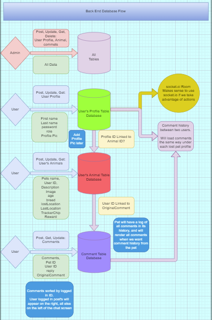

# lost-pet-finder-frontend

## NOTE: make note that we want to add functionality to give pets homes as well.

<div id="top"></div>
<!--
*** Thanks for checking out the Best-README-Template. If you have a suggestion
*** that would make this better, please fork the repo and create a pull request
*** or simply open an issue with the tag "enhancement".
*** Don't forget to give the project a star!
*** Thanks again! Now go create something AMAZING! :D
-->

<!-- PROJECT SHIELDS -->
<!--
*** I'm using markdown "reference style" links for readability.
*** Reference links are enclosed in brackets [ ] instead of parentheses ( ).
*** See the bottom of this document for the declaration of the reference variables
*** for contributors-url, forks-url, etc. This is an optional, concise syntax you may use.
*** https://www.markdownguide.org/basic-syntax/#reference-style-links
-->

[![Contributors][contributors-shield]][contributors-url]
[![Forks][forks-shield]][forks-url]
[![Stargazers][stars-shield]][stars-url]
[![Issues][issues-shield]][issues-url]
[![MIT License][license-shield]][license-url]

<!-- PROJECT LOGO -->
<!-- TODO ADD LOGO 
<div align="center">
  <a href="https://github.com/Floof-Finders">
    
  </a> -->

## Floof Finders

<!-- TABLE OF CONTENTS -->
<div>
  <summary>Table of Contents</summary>
  <ol>
    <li><a href="#about-the-project">About The Project</a></li>
    <li><a href="#getting-started">Getting Started</a></li>
    <!-- TODO <li><a href="#usage">Usage</a></li>
    <li><a href="#roadmap">Roadmap</a></li> -->
    <li><a href="#contributing">Contributing</a></li>
    <li><a href="#license">License</a></li>
    <li><a href="#contact">Contact</a></li>
    <li><a href="#acknowledgments">Acknowledgments</a></li>
  </ol>
</div>

<!-- ABOUT THE PROJECT -->
## About The Project

>Backend applcation to talk to your frontend and store our pets/data in a relational postgreSQL database.

## UML



### Built With

* [Base-64](https://www.npmjs.com/package/base-64)
* [BCrypt](https://www.npmjs.com/package/bcrypt)
* [Cors](https://www.npmjs.com/package/cors)
* [Dotenv](https://www.npmjs.com/package/dotenv)
* [ESLint](https://eslint.org/)
* [Express](https://expressjs.com/)
* [Heroku](https://heroku.com)
* [Jest](https://jestjs.io/)
* [JWT](https://jwt.io/)
* [Node Fetch](https://www.npmjs.com/package/node-fetch)
* [NodeJS](https://nodejs.org/en/)
* [REST API](https://restfulapi.net/)
* [Sequelize](https://sequelize.org/)
* [SQLite3](https://www.sqlite.org/)
* [SuperTest](https://www.npmjs.com/package/supertest)
* [Nock](https://www.npmjs.com/package/nock)
* [PG](https://www.npmjs.com/package/pg)

<!-- TODO -->
## Getting Started

```sh
# Install NPM
npm install npm@latest -g

# Clone the repository
git clone git@github.com:Floof-finderslost-pet-finder-backend.git

# Dev Database setup
Set up postgreSQL on your machine, starting up your database, and create your database.

CREATE DATABASE "floofs"

# Running locally
npm run dev

# Running tests
npm run test
```

## Optional for using in Production Environment

```JavaScript
INSTALLATION
npm install axios --save

REQUEST
import axios from "axios";

const options = {
  method: 'GET',
  url: 'https://',
  headers: {'X-API-KEY': 'apiKeyHere'}
};

axios.request(options).then(function (response) {
  console.log(response.data);
}).catch(function (error) {
  console.error(error);
});
```

<!-- TODO USAGE EXAMPLES  -->
## Usage

Our application was developed to help bring animals back to their owners in the fastest way possible, using technology and not having to rely on word of mouth of friends and posters to post around town.

## Sample.env

```JavaScript
PORT=<portnumberhere>
DATABASE_URL=<databaseOS>://localhost:5432/<databasename>
SECRET=<secretPWhere>
```
See the [open issues](https://github.com/Floof-Finders/issues) for a full list of proposed features (and known issues).

## Testing

This repository is tested using [jest](https://jestjs.io/). An example test can be seen below.

```JavaScript
'use strict'

const supertest = require('supertest')
const server = require('./server')
const request = supertest(server.server)

describe('Given /', () => {
  describe('When GET', () => {
    it('Then returns 200 status', async () => {
      const response = await request.get('/')
      expect(response.status).toEqual(200)
    })

    it('Then returns correct response body', async () => {
      const response = await request.get('/')
      expect(response.text).toEqual('Floof-Finders')
    })
  })
})
```

<!-- CONTRIBUTING -->
## Contributing

Contributions are what make the open source community such an amazing place to learn, inspire, and create. Any contributions you make are **greatly appreciated**.

If you have a suggestion that would make this better, please fork the repo and create a pull request. You can also simply open an issue with the tag "enhancement".
Don't forget to give the project a star! Thanks again!

1. Fork the Project
2. Create your Feature Branch (`git checkout -b feature/AmazingFeature`)
3. Commit your Changes (`git commit -m 'Add some AmazingFeature'`)
4. Push to the Branch (`git push origin feature/AmazingFeature`)
5. Open a Pull Request

<!-- LICENSE -->
## License

Distributed under the MIT License. See `LICENSE.txt` for more information.

<!-- CONTACT -->
## Contact

Heather Bisgaard - [@vbchomp](https://github.com/vbchomp) - [LinkedIn Profile](https://www.linkedin.com/in/heather-bisgaard/) - vbchomp@gmail.com  
Charlie Fadness - [@fadnesscharlie](https://github.com/fadnesscharlie) - [LinkedIn Profile](https://www.linkedin.com/in/cfadness/) - fadness.charlie@outlook.com  
Mark Thanadabouth - [@markjackson28](https://github.com/markjackson28) - [LinkedIn Profile](linkedin.com/in/markjackson28) - mark28ten@gmail.com 

Project Link: [https://github.com/Floof-Finders](https://github.com/Floof-Finders)

<!-- ACKNOWLEDGMENTS -->
## Acknowledgments

* [Socket.io Stack Overflow](https://stackoverflow.com/questions/62208654/notification-system-using-socket-io)
* [push notifications with socket.io](https://hetaram37.medium.com/real-time-notifications-using-socket-io-nodejs-and-angular-ec2df283d00b)
* [Jest IO](https://jestjs.io/docs/tutorial-react)
* [Testing recipes](https://reactjs.org/docs/testing-recipes.html)
* [Unit Test Token Verification for Auth0 using Jest and mock-jwks](https://codeburst.io/unit-test-token-verification-for-auth0-using-jest-and-mock-jwks-2c8488df97d6)
* [A Practical Guide To Testing React Applications With Jest](https://www.smashingmagazine.com/2020/06/practical-guide-testing-react-applications-jest/)
* [A Beginner's Guide to Unit-testing with Jest Part 1 & 2](https://dev.to/dsasse07/a-beginner-s-guide-to-unit-testing-with-jest-45cc)
* [Quick Introductory SQL Concepts](https://dataschool.com/learn-sql/introduction/)
* [Postgres Guide](https://www.postgresguide.com/utilities/psql/)
* [Postgresql.org](https://www.postgresql.org/docs/9.1/app-createdb.html)
* [How to set primary key type to UUID via Sequelize CLI](https://stackoverflow.com/questions/40734263/how-to-set-primary-key-type-to-uuid-via-sequelize-cli)
* [Sequelize.org](https://sequelize.org/master/manual/legacy.html#foreign-keys)
* [Auth0](https://manage.auth0.com/dashboard/us/dev-h-7-74qs/)

<p align="right">(<a href="#top">back to top</a>)</p>

<!-- MARKDOWN LINKS & IMAGES -->
<!-- https://www.markdownguide.org/basic-syntax/#reference-style-links -->
[contributors-shield]: https://img.shields.io/github/contributors/Floof-Finders/lost-pet-finder-backend.svg
[contributors-url]: https://github.com/Floof-Finders/lost-pet-finder-backend/graphs/contributors
[forks-shield]: https://img.shields.io/github/forks/Floof-Finders/lost-pet-finder-backend.svg
[forks-url]: https://github.com/Floof-Finders/lost-pet-finder-backend/network/members
[stars-shield]: https://img.shields.io/github/stars/Floof-Finders/lost-pet-finder-backend.svg
[stars-url]: https://github.com/Floof-Finders/lost-pet-finder-backend/stargazers
[issues-shield]: https://img.shields.io/github/issues/Floof-Finders/lost-pet-finder-backend
[issues-url]: https://github.com/Floof-Finders/lost-pet-finder-backend/issues
[license-shield]: https://img.shields.io/github/license/Floof-Finders/lost-pet-finder-backend.svg
[license-url]: https://github.com/Floof-Finders/lost-pet-finder-backend/blob/master/LICENSE.txt
[check-sheild]: https://github.com/Floof-Finders/actions/workflows/checks.yaml/badge.svg
[check-url]: https://github.com/Floof-Finders/lost-pet-finder-backend/actions/workflows/checks.yaml
[codecov-sheild]: https://codecov.io/gh/Floof-Finders/lost-pet-finder-backend/branch/main/graph/badge.svg?token=7SL7D08EZB
[codecov-url]: https://codecov.io/gh/Floof-Finders/lost-pet-finder-backend
